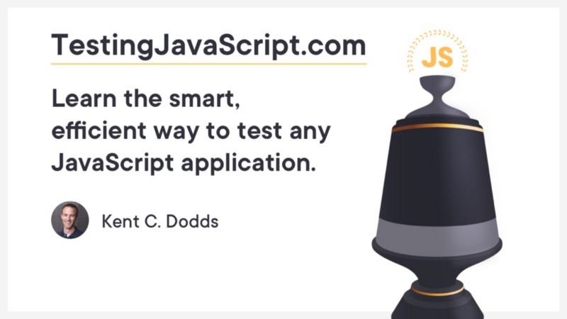

[The Assert(js) Conference](https://www.assertjs.com/) is just about a month
away. I’m really excited about attending,
[speaking](https://www.assertjs.com/speakers), and
[workshopping](https://www.assertjs.com/training) at a conference all about
testing JavaScript.

In preparation for the conference, the organizers invited us speakers to answer
a few questions about testing. Here are my answers!

### What testing tools and/or workflow do you use?

I’ve used pretty much every testing tool for JavaScript there is. I started with
QUnit, then used Jasmine, Mocha, sprinkled some Karma to run things, and then I
had to figure out how to make things work with babel and webpack, then throwing
in code coverage reporting made things really complicated. I even gave a meetup
talk called
“[ES6, Webpack, Karma, and Code Coverage](https://kentcdodds.com/talks/#es6-webpack-karma-and-code-coverage)”
because it was complicated enough to justify a 45 minute demo/tutorial.

To make a long story short, I eventually bumped into
[Jest](https://facebook.github.io/jest): reborn. I’d used Jest when it was the
joker testing framework (pun intended) because it was so slow, but I started to
hear it was getting fast. Like… reeeally fast. On top of that, it had all the
configuration baked-in. And it has the most incredible watch mode ever.

So, what tool do I use? I’m in love with
[Jest](https://facebook.github.io/jest). ❤️🃏

That said, if I want to run E2E tests, I have to recommend
[Cypress](https://www.cypress.io/). No more selenium for me.
[Cypress.io](https://medium.com/u/47c842e55929) is where it’s at.
[Watch this for more on why](https://www.youtube.com/watch?v=lK_ihqnQQEM).

### What is one thing would you change in the JS testing ecosystem?

I think that we as a community are in love with poking holes in the world of our
applications to make things easier to test by creating Test Doubles/mocks/stubs
for anything and everything. Whether it’s shallow rendering a react component or
mocking all of its dependencies, we’re reducing our confidence that our
applications work properly by mocking the world and testing implementation
details.

For more on this, I suggest checking out my blog post: “Write tests. Not too
many. Mostly integration.”

[**Write tests. Not too many. Mostly integration.**  
\_Guillermo Rauch tweeted this a while back. Let’s take a quick dive into what it means.\_blog.kentcdodds.com](https://blog.kentcdodds.com/write-tests-not-too-many-mostly-integration-5e8c7fff591c 'https://blog.kentcdodds.com/write-tests-not-too-many-mostly-integration-5e8c7fff591c')

### A lot of people in the JS world don’t have a lot of experience in testing. How would you recommend they get started?

I think one of the things that makes testing hard is not understanding what’s
going on with testing frameworks. That’s why I wrote the blog post “But really,
what is a JavaScript test?”

[**But really, what is a JavaScript test?**  
\_Let’s take a step back and understand automated testing of JavaScript from square one.\_blog.kentcdodds.com](https://blog.kentcdodds.com/but-really-what-is-a-javascript-test-46fe5f3fad77 'https://blog.kentcdodds.com/but-really-what-is-a-javascript-test-46fe5f3fad77')

In it I show what a test is, define a few terms, and help folks come to
understand what a test is. Once you get that basic concept down, then everything
else becomes much easier to understand and use.

<figcaption>[TestingJavaScript.com](https://testingjavascript.com) Learn the smart, efficient way to test any JavaScript application.</figcaption>
